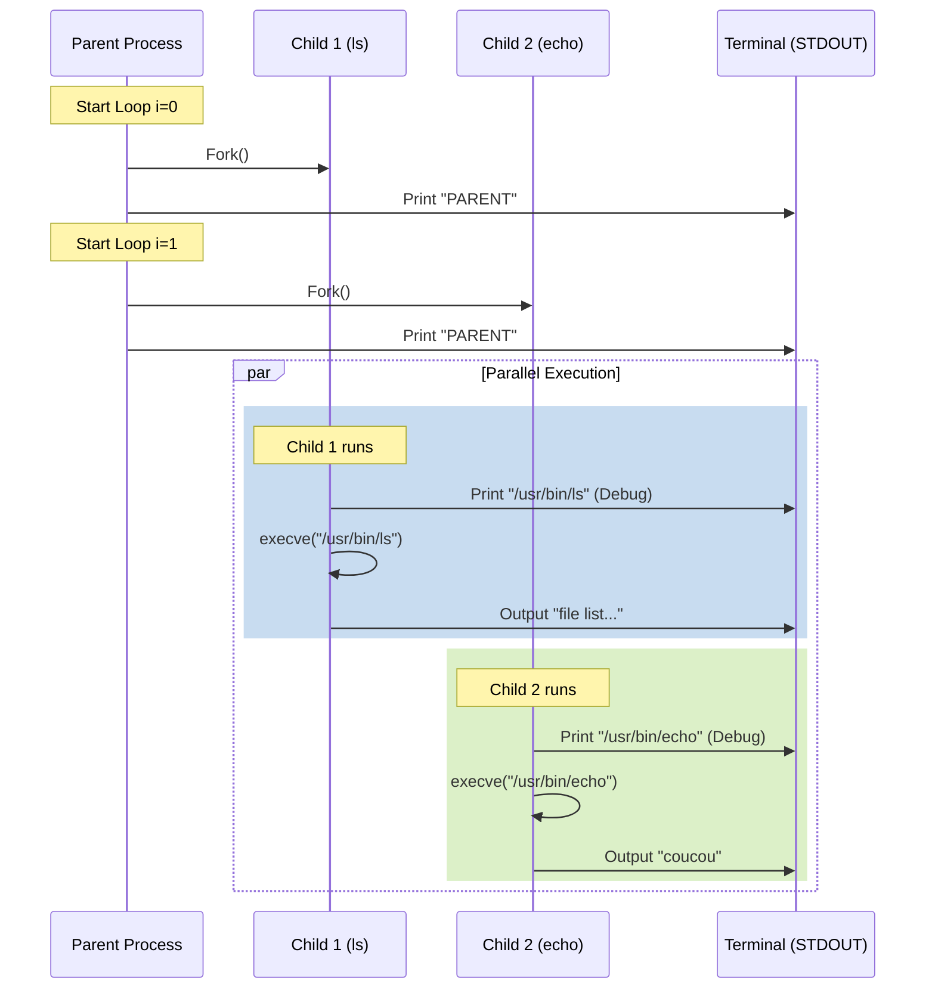

# Execution Analysis

## Why do you have this output?

The output you see is a result of **Parallel Execution** and **Missing Redirections**.

### 1. The Output Breakdown
```text
PARENT          <-- Parent Loop 1 (After forking Child 1)
PARENT          <-- Parent Loop 2 (After forking Child 2)
/usr/bin/echo   <-- Child 2 Debug Print (in parsing.c)
/usr/bin/ls     <-- Child 1 Debug Print (in parsing.c)
coucou          <-- Child 2 Execution (echo)
total 136       <-- Child 1 Execution (ls)
...
```

### 2. The Explanation
1.  **"PARENT" prints**: Your main process runs a `while` loop. It forks a child, prints "PARENT", loops, forks the next child, prints "PARENT". This happens very fast, often before children have time to start their tasks.
2.  **Debug Paths**: Inside `ft_correct_path`, you have `ft_printf("%s\n", path);`. Since both children run this function to find their command paths, both print to the terminal.
3.  **Command Outputs (`ls` & `echo`)**:
    *   Currently, you are **not using `dup2`** to redirect `STDOUT` (Standard Output) or `STDIN` (Standard Input).
    *   By default, children inherit file descriptors from the parent.
    *   So, both `ls` and `echo` get the **Terminal** as their output destination.
    *   Instead of `ls` writing to the pipe, it writes to the screen.
    *   Instead of `echo` reading from the pipe (if it could), it just prints its arguments to the screen.

---

## Order of Execution

The Operating System scheduler decides exactly when each process runs, but here is the logical flow:

1.  **PARENT**: Starts Loop `i=0`.
2.  **PARENT**: Creates Pipe 0.
3.  **PARENT**: calls `fork()`. **CHILD 1** is created.
4.  **PARENT**: Continues immediately. Prints "PARENT".
5.  **PARENT**: Starts Loop `i=1`.
6.  **PARENT**: Creates Pipe 1.
7.  **PARENT**: calls `fork()`. **CHILD 2** is created.
8.  **PARENT**: Continues immediately. Prints "PARENT".
9.  **PARENT**: Finish loops and exits (or waits, if you added `waitpid`).

*At the same time (concurrently):*

10. **CHILD 1**:
    *   Enters `if (pid == 0)`.
    *   Calls `ft_correct_path("ls")`.
    *   Prints `/usr/bin/ls`.
    *   Calls `execve`. Process becomes `ls`.
    *   `ls` prints file list to Terminal (FD 1).

11. **CHILD 2**:
    *   Enters `if (pid == 0)`.
    *   Calls `ft_correct_path("echo")`.
    *   Prints `/usr/bin/echo`.
    *   Calls `execve`. Process becomes `echo`.
    *   `echo` prints "coucou" to Terminal (FD 1).

---

## Execution Schema



### Visualizing File Descriptors (Current State vs Goal)

**current State (Wrong):**
```text
[Child 1]  FD 1 (STDOUT) ----------------> [Terminal]
[Child 2]  FD 1 (STDOUT) ----------------> [Terminal]
```

**Goal State (Pipex):**
```text
[Child 1]  FD 1 (STDOUT) ----> [PIPE] ----> [Child 2] FD 0 (STDIN)
                                                |
                                                v
                                           [Child 2] FD 1 (STDOUT) -> [File/Terminal]
```
