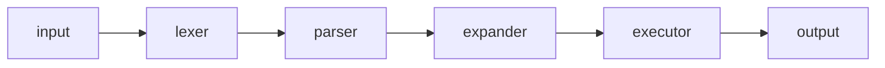

# IMPROVEMENT.md

A pragmatic checklist of upgrades for `Purgatoire`, ordered from **quick wins** (15 min) to **long-term craftsmanship** (weeks). Each item states *what*, *why*, and *how* — pick the ones that match where you want to grow.

---

## 🥇 Quick wins — do these today

### 1. Stop tracking binaries and OS junk
Currently tracked:
- `.DS_Store` (macOS metadata — useless on Linux)
- `LEVEL2/PushSwap/push_swap`, `checker_linux`, `visualizer` (**1.2 MB** binary)
- `LEVEL2/PushSwap/imgui.ini`
- `LEVEL2/Pipex/outfile`, `LEVEL2/Pipex/wc` (test run artefacts)

**Why:** binaries bloat the repo, aren't portable across machines, and leak your test state into history. Future-you clones this on a fresh VM and the binary segfaults because it was compiled against a different libc.

**How:**
```bash
git rm --cached .DS_Store \
    LEVEL2/PushSwap/push_swap LEVEL2/PushSwap/checker_linux \
    LEVEL2/PushSwap/visualizer LEVEL2/PushSwap/imgui.ini \
    LEVEL2/Pipex/outfile LEVEL2/Pipex/wc
```
Then extend `.gitignore` (see item 2).

### 2. Grow your `.gitignore`
Today it's three lines (`*.o *.a *.d`). Add:

```gitignore
# OS
.DS_Store
Thumbs.db

# Editors
.vscode/
.idea/
*.swp

# Build outputs (42)
*.o
*.a
*.d
*.dSYM/

# Project binaries — rebuild, don't commit
LEVEL1/PRINTF/libftprintf.a
LEVEL2/PushSwap/push_swap
LEVEL2/PushSwap/checker_linux
LEVEL2/PushSwap/visualizer
LEVEL2/Pipex/pipex
LEVEL2/So_Long/so_long
LEVEL3/philo/philo
LEVEL3/minishell/minishell
LEVEL4/cub3d/cub3d
LEVEL4/C++1/**/a.out
LEVEL4/C++1/**/*.out

# Test artefacts
LEVEL2/Pipex/outfile
LEVEL2/Pipex/wc
```

### 3. Remove stray `home/` trees
`home/fardeau/.config/` and `LEVEL4/C++1/home/{fardeau,tibras}/` look like accidental copies of a system config or peer's work. Unless intentional, delete — they ship personal dotfiles in a public repo.

### 4. Delete the empty `Subjects/` folder (or fill it)
Empty folders erode signal. If you want to keep subject PDFs, commit at least a `.gitkeep` + a note explaining what goes there. Otherwise remove.

### 5. Rename scratch docs
`ROADMAP.md`, `RESTANT.md`, `PIPEX_FIXLIST.md` are TODO lists, not documentation. Move them to a `TODO.md` per project — or better, convert each unchecked item into a GitHub Issue. Issues beat scattered markdown because they surface on the repo front page and close automatically on merge.

---

## 🧱 Repo structure

### 6. Kill the vendored libft copies
`LEVEL3/minishell/libft/` and `LEVEL4/cub3d/libft/` are **full copies** of libft, not submodules. That means:
- Three forks of the same library drift apart.
- A bug fixed in the root libft stays broken in minishell's copy.
- You ship `.o` files cluttering the tree.

**How:** replace each vendored copy with a submodule pointing to the same URL as the root:
```bash
cd LEVEL3/minishell && rm -rf libft
git submodule add https://github.com/FardeauRobot/libft_official.git libft
```
Do the same for cub3d. Now one source of truth.

### 7. Project READMEs should look the same
Right now:
- `PushSwap/README.md` is literally a copy of libft's README 🫠
- `Pipex/README.md` uses tabs + "Description/Instructions/Resources".
- `So_Long/README.md` uses the same template.
- `minishell/README.md` is its own thing.
- `philo/`, `cub3d/`, `C++1/`, `GNL/`, `PRINTF/`, `B2B/` have **no README**.

**How:** write a `docs/project-template.md` (Description, Build, Run, Architecture, Caveats, Sources) and port every project to it. Consistency is a multiplier — you spend less time reorienting when you come back in 6 months.

### 8. One canonical place for notes, not two
`LEVEL4/C++1/docu/` has 18 excellent study notes (CASTS.md, POLYMORPHISM.md, OCF...). These belong in a top-level `notes/` or `docs/cpp/` so they're discoverable without digging into a module folder. Same for `Pipex/docs/PIPEX_FIXLIST.md`.

### 9. Root-level `Makefile` with per-project targets
Add:
```makefile
.PHONY: all clean fclean libft printf gnl pipex push_swap so_long philo minishell cub3d cpp

all: libft printf gnl pipex push_swap so_long philo minishell cub3d
libft:      ; $(MAKE) -C libft
printf:     ; $(MAKE) -C LEVEL1/PRINTF
pipex:      ; $(MAKE) -C LEVEL2/Pipex
push_swap:  ; $(MAKE) -C LEVEL2/PushSwap
# ...
clean:      ; for d in libft LEVEL1/PRINTF LEVEL2/*; do $(MAKE) -C $$d clean; done
```
One `make all` to rebuild the world. Catches regressions fast.

---

## 🔧 Build & tooling

### 10. Generate compile databases
Add `bear -- make` (or `compiledb make`) to produce `compile_commands.json` per project. Unlocks:
- Clangd LSP (jump-to-def, rename, autocomplete across projects)
- Clang-tidy static analysis
- Better editor experience than any 42-flavoured vim setup

### 11. Enable sanitizers in dev mode
Add a `debug` target to every Makefile:
```makefile
debug: CFLAGS += -g3 -fsanitize=address,undefined -fno-omit-frame-pointer
debug: re
```
ASan catches leaks, UAF, heap-buffer-overflow — the exact bugs that cost you points at evaluation. UBSan catches signed overflow and alignment issues.

For **philosophers** add `-fsanitize=thread` as a separate target (TSan ≠ ASan) — it will find the data race you can't reproduce.

### 12. Run valgrind systematically
Script it. Drop this in `Scripts/vg.sh`:
```bash
#!/usr/bin/env bash
valgrind --leak-check=full --show-leak-kinds=all --track-origins=yes \
         --errors-for-leak-kinds=all --error-exitcode=42 "$@"
```
For minishell, use the `readline.supp` you already have:
```bash
valgrind --suppressions=readline.supp ./minishell
```
Exit code 42 on leak = CI-friendly.

---

## 🧪 Testing

### 13. Add per-project tests
Nothing in this repo has tests except `test_pipex.sh`. Minimum viable:
- **libft:** [`42_ft_libft`](https://github.com/alelievr/libft-unit-test) or Francinette.
- **printf / GNL:** diff your output against the real `printf` / `cat` for fuzzed inputs.
- **push_swap:** you already ship `checker_linux` — wrap it in a shell loop with random `seq | shuf` inputs and count ops.
- **philo:** scripted scenarios with `[1 800 200 200]`, `[4 410 200 200]`, `[5 800 200 200 7]`.
- **minishell:** diff against bash. Run the same input through both and `diff` the output.

You'll find bugs before the eval does.

### 14. Continuous Integration
Add `.github/workflows/ci.yml`:
```yaml
name: CI
on: [push, pull_request]
jobs:
  build:
    runs-on: ubuntu-latest
    steps:
      - uses: actions/checkout@v4
        with: { submodules: recursive }
      - run: sudo apt-get install -y norminette valgrind
      - run: make all
      - run: make -C libft test    # when you add them
```
A green badge on the README is the cheapest signal that your main branch builds. Also forces you to notice when a push breaks another project — cross-project regressions are invisible otherwise.

### 15. Norminette on pre-commit
`.git/hooks/pre-commit`:
```bash
#!/usr/bin/env bash
files=$(git diff --cached --name-only --diff-filter=ACM | grep -E '\.[ch]$')
[ -z "$files" ] && exit 0
norminette $files || { echo "✗ norme"; exit 1; }
```
Never push a non-normed file again.

---

## 🧠 Programmer skills worth investing in

These are general skills the 42 curriculum doesn't force you to learn deeply but that compound enormously.

### 16. **Debuggers > `printf`**
Learn `gdb` (or `lldb`) **properly**: breakpoints, watchpoints, `bt`, `frame`, `print *struct`, reverse-step (`rr`). Half the time you spend eyeballing a segfault is time you'd recover in 30 s with `bt`. For minishell and cub3d, this is non-negotiable.

Keystroke budget to learn: 2 evenings. Payoff: the rest of your career.

### 17. **strace / ltrace**
When a syscall is misbehaving, `strace -f ./minishell` shows you every `fork`/`execve`/`dup2`/`pipe` live. Cheaper than reading your own code.

### 18. **Read the actual source**
- `glibc`'s `strlcpy`, `memmove`, `calloc` — see what the grown-ups write.
- `bash`'s lexer + parser source (referenced in your minishell README — *actually read it*, don't just cite it).
- `xv6` for the OS-level intuition behind pipex and minishell.

### 19. **Learn one profiler**
`perf stat ./push_swap $(seq 1 500 | shuf)` and `perf record/report` to see where your time goes. For push_swap optimisation this is the difference between guessing and knowing.

### 20. **Version control hygiene**
Current commits like `REFACTO AVEC L'AIDE DU COLLEGUE` and `On avancera mieux a la maison` lose information fast. Try [Conventional Commits](https://www.conventionalcommits.org/):
```
feat(push_swap): add LIS-based sorter for >100 ints
fix(gnl): free buffer on read error
refactor(minishell): extract heredoc expansion into its own file
```
Your own future self is the primary beneficiary.

Also: **small branches, small PRs**. `newcub` branch has 20+ commits without merging — hard to bisect, hard to review.

### 21. **Learn a scripting language that isn't bash**
Your `Scripts/` is entirely bash. For anything >50 lines, Python or Go writes in half the lines, handles errors explicitly, and has a real stdlib. Good candidate: rewrite `autopush` or `watch_norminette.sh` in Python as an exercise.

### 22. **Read *The Pragmatic Programmer* and *The C Programming Language* (K&R)**
If you haven't. K&R is 270 pages and will upgrade your C instincts permanently. The Pragmatic Programmer will change how you think about tools, automation, and your own growth.

### 23. **Attack your weakest project**
What scares you most from the list? Write it down, then spend a weekend rebuilding the scariest module from scratch without looking at the old code. Spaced repetition of hard concepts is how you lock them in.

---

## 🏛️ Long-term investments

### 24. **Dotfiles repo, not project scripts**
`remind`, `note`, `autopush`, `watch-norm` are personal workflow tools, not 42 project code. Split them into a separate `dotfiles` or `bin` repo symlinked to `~/.local/bin`. Keeps Purgatoire focused on course work.

### 25. **Architecture diagrams for big projects**
For minishell and cub3d, one Mermaid diagram in the README beats 500 words. Example for minishell:

Forces you to crystallise the design.

### 26. **Post-mortem docs for each finished project**
A `POSTMORTEM.md` after every validated project:
- What did I underestimate?
- What would I do differently?
- What's one technique I learned that transfers?

After 10 projects you have a personal engineering playbook that nobody else on the planet has.

### 27. **Public side-project that uses what you learned**
The biggest lever on post-42 employment is a public project that shows off skill. A small raycaster in Rust, a toy shell, a text-editor — pick one, build it in the open, blog the decisions.

---

## 📋 Priority matrix

| Effort | Impact | Items |
|---|---|---|
| 15 min | 🔥🔥 | 1, 2, 3, 4 |
| 1 hour | 🔥🔥🔥 | 6, 7, 11, 15 |
| 1 evening | 🔥🔥 | 8, 9, 10, 12, 16 |
| 1 week | 🔥🔥🔥 | 13, 14, 20, 23 |
| Ongoing | 🔥🔥🔥 | 17, 18, 19, 21, 22, 26 |

Pick two. Don't try to do them all at once — the point is momentum, not perfection.
